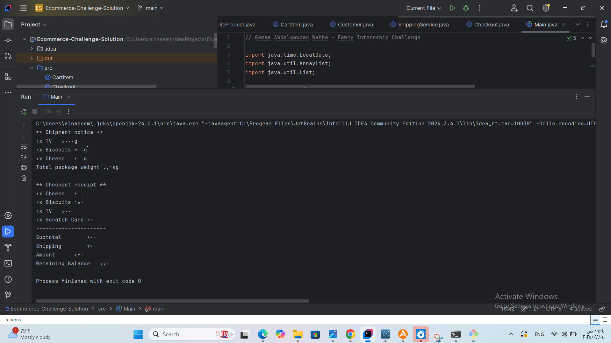

#  E-commerce System – Fawry Internship Challenge

This project is a simple object-oriented Java application simulating an e-commerce system, implemented for the **Fawry Rise Full Stack Internship Challenge**.

##  Features

- Define products with name, price, quantity
- Handle:
  - Expirable products (like Cheese, Biscuits)
  - Shippable products (like TV)
  - Non-shippable products (like Scratch Cards)
- Cart functionality with quantity validation
- Checkout process with:
  - Subtotal, shipping, and total amount
  - Balance validation
  - Shipping service for shippable items
- Error handling for edge cases:
  - Empty cart
  - Out of stock / expired products
  - Insufficient customer balance

---

##  Console Output Example

---

##  Technologies

- Java 23+
- Object-Oriented Programming
- Interface & Inheritance
- Basic Collections (ArrayList, HashMap)

---

**Gomaa Abdelgawoad Wahba**  
_For Fawry Internship Submission_

